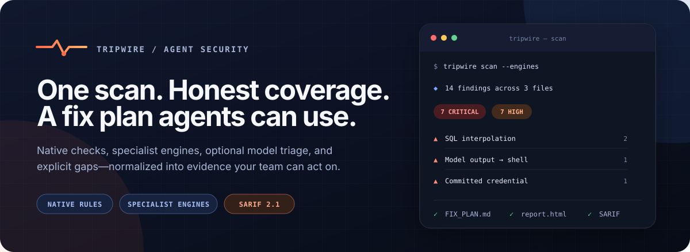
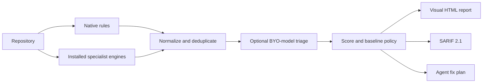
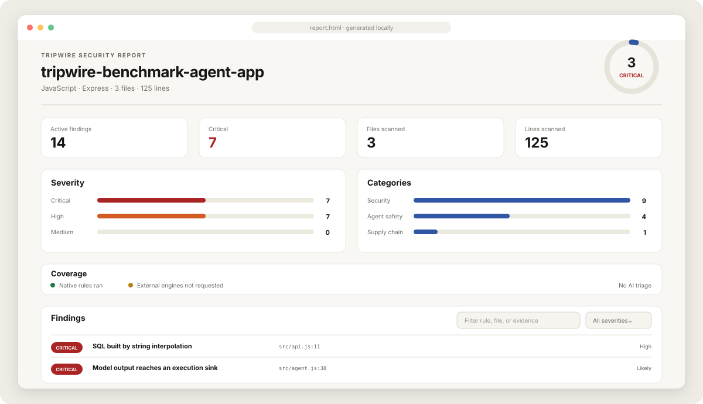
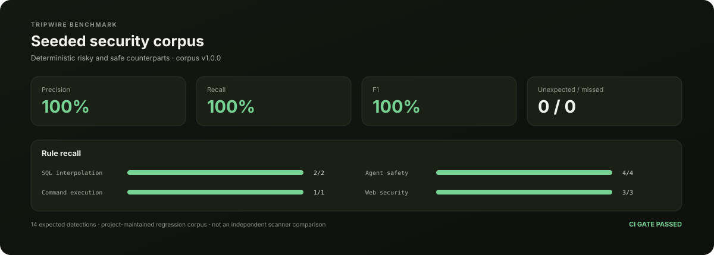

# Tripwire

<p align="center">
  
</p>

<p align="center">
  <a href="https://www.npmjs.com/package/@lapointelabs/tripwire"></a>
  <a href="https://github.com/lapointelabs/tripwire/actions/workflows/ci.yml"></a>
  <a href="LICENSE"></a>
  
</p>

<p align="center">
  <a href="#quick-start">Quick start</a> ·
  <a href="#what-it-produces">Visual report</a> ·
  <a href="#external-engines">Engines</a> ·
  <a href="#benchmarks">Benchmarks</a> ·
  <a href="docs/enterprise.md">Enterprise adoption</a>
</p>

Security scan for Claude Code, Cursor, and coding agents. Tripwire finds injection sinks,
committed credentials, unsafe web defaults, and the ways a repository misleads the model
reading it—then writes a fix plan an agent can execute.

Alongside the usual scanner territory it covers a category most scanners miss:
prompt-injection surfaces, model output flowing into a shell, tool descriptions assembled
from runtime data, doc blocks that disagree with their signature, and `CLAUDE.md` files
pointing at scripts that no longer exist.

Where a specialist tool is better — cross-file dataflow, credential verification, advisory
databases — Tripwire [runs that tool](#external-engines) instead of reimplementing it, and
reconciles the output into one report, one score, and one fix plan.

Two rules shape the output. **A rule that could not run is reported as gated, never as
clean**, so a quiet report and a clean codebase never look the same. And **every finding
carries a confidence level** that flows into the score, the report, and the fix plan;
uncertain ones are labelled as leads and are the ones sent for review.

By [Marc Lapointe](https://lapointelabs.com/about) at Lapointe Labs. Requires Node.js 20.1+.

## Quick start

```sh
npx @lapointelabs/tripwire scan
```

In a monorepo, every project is detected and grouped by stack:

```
  4 projects detected. Which should Tripwire scan?

  TypeScript · Next.js
     1. storefront                  apps/storefront
  C# · ASP.NET Core (net8.0)
     2. Billing.Api                 services/billing
  Python · FastAPI
     3. ingest                      services/ingest
   a. all of them
```

Pick one, or pass `--project all` to skip the prompt in CI.

## How it works



Tripwire owns the orchestration, evidence model, and policy layer. Specialist scanners keep
owning the deep analysis they are best at.

## Use it as an agent skill

```sh
npx @lapointelabs/tripwire@latest skills install
```

Only the harnesses your repository already uses get written:

| Harness | File |
| --- | --- |
| Claude Code, Claude in VS Code | `.claude/skills/tripwire/` (skill bundle) |
| Cursor | `.cursor/skills/tripwire/` (skill bundle) |
| GitHub Copilot, VS Code | `.github/instructions/tripwire.instructions.md` |
| Codex, Amp, Jules, Zed, and others | `AGENTS.md` |

Claude Code and Cursor get a bundle rather than a passive rule file: `SKILL.md` plus
`references/triage.md` (the scan → triage → fix → verify loop) and `references/rules.md`
(generated from the live rule set). Only the frontmatter description sits in context — the
body loads on invocation, the references only if the agent needs them. Both set
`disable-model-invocation: true`, so they run on `/tripwire` or a request to scan, not on
every turn. The playbook ships inside the package rather than being fetched, so it works
offline and behind a restrictive proxy.

An existing `AGENTS.md` is appended to inside HTML comment markers, so your instructions
survive and a reinstall replaces Tripwire's section in place. A hand-written skill is never
overwritten without `--force`.

```sh
tripwire skills list                                    # what was detected
tripwire skills install --harness claude,cursor         # target specific harnesses
tripwire skills install --harness cursor --root ~       # once for every project
tripwire skills install --command "pnpm tripwire"       # pin the invocation
```

## What it produces

Nothing is written into your repository by default. The terminal output is the primary
read; artifacts land in a cache directory outside the tree and the scan prints the path.

<p align="center">
  
</p>

<p align="center"><sub>Real output from the bundled vulnerable fixture · deterministic scan · no external engines or model triage</sub></p>

| File | When | Purpose |
| --- | --- | --- |
| `FIX_PLAN.md` | always | **The one to hand an agent.** One task per finding, ordered by severity, each with acceptance criteria. |
| `findings.json` | always | Machine-readable, including refuted findings and why. |
| `report.md` | `--out` | Long-form read: evidence, triage notes, what was not covered. |
| `report.html` | `--out` | Self-contained visual report with severity, coverage, baseline, and finding filters. |
| `tripwire.sarif` | `--out` | SARIF 2.1.0 for GitHub code scanning. |

`--out DIR` writes all five, and is the only way anything lands inside the repository.
When several projects are scanned, each gets a directory under `DIR` matching its project
path, so one project's artifacts never overwrite another's.

`FIX_PLAN.md` opens with a protocol closing the loopholes an agent reaches for under
pressure — no suppression comments, no scanner-dodging renames, no blanket refactors, no
marking a credential fixed when the line was deleted and the key never rotated:

```markdown
### 1. [ ] SQL built by string interpolation — `src/api.js:11`

> CRITICAL · injection/sql-interpolation · high confidence — the pattern is unambiguous

**Done when:**

- [ ] Every value that varies at runtime reaches the query as a bound parameter.
- [ ] Any dynamic identifier is validated against a hard-coded allow-list.
- [ ] No ignore comment, rule disable, or scanner-dodging rename was used.
```

Marking a task `[~] not applicable` with a reason is an explicitly correct outcome. A plan
that only permits "fixed" teaches agents to force changes into code that was already fine.

## Rule packs

`tripwire rules` lists all of them.

**Security** — SQL, command, and NoSQL injection; runtime code evaluation and unsafe
deserialization; path traversal; raw HTML sinks; permissive CORS; disabled TLS
verification; fast hashes on credentials; predictable randomness for secrets; unvalidated
redirects; committed credentials across fourteen vendor token formats.

**Agent safety** — external data spliced into prompts without a data/instruction boundary;
model output reaching a shell, query, or filesystem; tool descriptions assembled at
runtime; disabled agent permission gates; secrets interpolated into prompt text;
instruction-override phrasing in source or in a `CLAUDE.md`; doc blocks that disagree with
their signature; comments contradicting the code beneath them; instruction files
referencing paths and npm scripts that do not exist.

**Supply chain** — missing or uncommitted lockfiles; dependencies pinned to `*`/`latest` or
to a movable git ref; unrestricted install scripts; registries over plain HTTP or with
certificate checks disabled; CI actions pinned to mutable tags rather than commit SHAs;
NuGet feeds without package source mapping; unpinned Python requirements and
`--extra-index-url` dependency-confusion exposure.

**Correctness, maintainability, performance** — silently discarded errors; monolith files;
oversized functions; deep nesting; long parameter lists; unused exports; cross-file
duplication; sequential awaits and linear lookups inside loops.

`tripwire explain RULE` prints what a rule matches, why it matters, what "done" looks like,
**and the shapes it is known to get wrong**, so an agent judging a false positive has
something concrete to check against.

## Language support

| Stack | Detected via | Coverage |
| --- | --- | --- |
| JavaScript / TypeScript | `package.json` | Full |
| React, Next.js, Nuxt, Remix, Svelte, Vue, Angular, Astro, NestJS, Express, Fastify | dependency fingerprint | Full |
| C# / .NET | `*.csproj` | Full |
| Python | `pyproject.toml`, `requirements.txt` | Full |
| Go, Rust, Ruby, PHP, Java | `go.mod`, `Cargo.toml`, `Gemfile`, `composer.json`, `pom.xml` | Security and structure |

Framework detection gates rules rather than guessing. A project with no model SDK in its
manifest does not get prompt-injection findings, and the report says so.

## Triage with your own model

The deterministic pass runs with no API key. It blanks comments and string bodies while
preserving byte offsets, so rules match real code rather than their own examples in a
docstring, and it finds loop and function bodies by brace and indent matching.

Optionally, uncertain findings are then batched to a model you choose, which confirms or
refutes each against the surrounding source. Refuted findings drop out of the score into
their own section. High-confidence findings are never sent, so cost tracks ambiguity rather
than repository size.

```sh
export ANTHROPIC_API_KEY=...
npx @lapointelabs/tripwire scan                                           # picks up the key

npx @lapointelabs/tripwire scan --provider ollama --model qwen2.5-coder   # fully local
npx @lapointelabs/tripwire scan --no-ai                                   # patterns only
```

`tripwire providers` shows what is configured.

| Provider | Key | SDK | Shape |
| --- | --- | --- | --- |
| `anthropic` | `ANTHROPIC_API_KEY` | `@anthropic-ai/sdk` | Chat endpoint |
| `openai` | `OPENAI_API_KEY` | `openai` | Chat endpoint (any OpenAI-compatible URL) |
| `cursor` | `CURSOR_API_KEY` | `@cursor/sdk` *(optional peer)* | Cloud agent |
| `ollama` | none | `ollama` | Local chat endpoint |

Each provider goes through its vendor's official SDK, which owns retry, backoff, timeouts,
and API drift. They are imported lazily, so a scan that never triages pays no load cost.
`--base-url` covers self-hosted and proxied gateways.

**Cursor's SDK is an optional peer** (`npm install @cursor/sdk`), because it pulls a
high-severity transitive advisory (`@connectrpc/connect-node` → `undici`, no fix available)
that would break `npm audit` for everyone installing a security scanner. Without it,
`--provider cursor` reports what to install and continues on pattern confidence. Cursor
launches agents rather than exposing a chat endpoint, so each batch runs as a no-repo cloud
agent: nothing is cloned, no branch or PR is created, and batches are larger at lower
concurrency because it is slower per call.

**Files flagged as containing a credential are never sent to any model.**

## External engines

Tripwire does not try to out-depth the specialists. A generalist reimplementing an advisory
database or a dataflow engine badly is worse than no coverage, because a shallow pass that
reports nothing reads exactly like a clean one.

```sh
npx @lapointelabs/tripwire@latest scan --engines           # every installed engine
npx @lapointelabs/tripwire@latest scan --engines semgrep,trufflehog
npx @lapointelabs/tripwire@latest engines                  # available, and missing
```

| Engine | Domain | What it adds |
| --- | --- | --- |
| **Opengrep** / **Semgrep** | Code | Interprocedural and cross-file dataflow — the gap named in [Limits](#limits) |
| **ProofLayer Full Scanner** | Code and agent surface | AST, taint, cross-file, MCP, and package-hallucination checks |
| **TruffleHog** | Secrets | **Verification.** Calls the issuer to ask whether the key is live |
| **Gitleaks** | Secrets | Offline detection, where verification is unwanted |
| **osv-scanner** | Dependencies | Every ecosystem's advisories from one binary |
| **Snyk Code** | Code | Commercial SAST · BYOK, `SNYK_TOKEN` |
| **Snyk Agent Scan** | Agent surface | Inspects the MCP servers and skills your agent loads |
| **Cisco AI Defense Skill Scanner** | Agent skills | Static, YARA, bytecode, pipeline, and behavioral dataflow analysis |
| **agnix** | Agent instructions | 440+ rules for `CLAUDE.md`, `AGENTS.md`, `SKILL.md`, hooks, MCP config |

Nothing is bundled, downloaded, or auto-installed — Tripwire runs binaries you already
have, and commercial engines authenticate with your key from your environment. `tripwire
engines` lists engines you have *not* installed and what each would have covered, because
the useful question is what is going unchecked.

Tools that already emit SARIF—most notably CodeQL—can be folded into the same normalized
report without Tripwire trying to own their build or database setup:

```sh
tripwire scan --import-sarif codeql-results.sarif --out .tripwire --no-ai
```

`--import-sarif` is repeatable. An invalid or missing report fails closed, while an optional
engine that is merely unavailable still degrades to a named coverage gap.

What the harness adds over running the tools by hand:

- **One finding model.** Every engine's severity and confidence is normalized onto the same
  four levels and three confidence tiers, then scored by the same function.
- **Overlap is reconciled, not concatenated.** Two engines and a native rule on one line
  collapse into the most authoritative finding, which records who else agreed. A *verified*
  credential outranks everything, an advisory outranks a pattern match, and a rule with a
  documented false-positive list outranks an external guess. Agreement lifts low confidence
  to medium and stops there.
- **Uncertain external findings hit the same triage layer.** Semgrep emits most rules at
  `error` while marking them `LOW CONFIDENCE`; run raw, those land as settled fact.
- **Provenance survives** into the terminal output, `findings.json`, the SARIF upload, and
  the fix plan's **Reported by** line.
- **Absence is reported.** Domains no engine covered are named.

```
      app.js:6
        Command string is assembled from a variable before reaching a shell.
        exec("ping -c 1 " + req.query.host, (err, out) => res.send(out));
        confirmed by Semgrep / Opengrep
    injection/command-execution

  Engines: semgrep 4 · trufflehog 1*
  * authenticated with your own key from the environment
  2 duplicate findings collapsed where engines agreed on the same line.
  Dependencies had no engine — Tripwire's own coverage is supply-chain posture only.
```

**Secrets never reach a model.** Any file that *any* source — a Tripwire rule, TruffleHog,
or Gitleaks — flagged as holding a credential is excluded from triage entirely. No raw
secret value reaches the report either: evidence is the redacted form or the detector name.

**Tripwire never passes `--dangerously-run-mcp-servers`** to Snyk Agent Scan. That flag
executes every command in an MCP config — the correct way to inspect a live server, and an
indefensible thing to do to you unasked. Repository config paths are passed explicitly, so
the tool inspects this project rather than sweeping your home directory.

### Air-gapped

```sh
npx @lapointelabs/tripwire@latest scan --engines --offline
```

`--offline` refuses any engine needing the network and disables credential verification, so
a secret reported under it was matched by shape rather than confirmed against its issuer —
and the report says exactly that.

### Config

`tripwire.config.json` or `.tripwire.json` at the project root. Entirely optional; every
value has a working default. Unknown keys are reported rather than ignored.

```json
{
  "$schema": "https://raw.githubusercontent.com/lapointelabs/tripwire/main/schemas/config.schema.json",
  "engines": {
    "semgrep": { "config": "p/ci", "limit": 200 },
    "trufflehog": { "args": ["--exclude-paths", ".trufflehogignore"] },
    "gitleaks": false
  },
  "scan": { "engines": "auto", "failOn": "high" }
}
```

## Dependency vulnerabilities

Tripwire ships no advisory database. `--engines` prefers **osv-scanner** when installed;
`--audit` is the no-install path, running the auditor your ecosystem already maintains.

```sh
npx @lapointelabs/tripwire@latest scan --audit
```

| Ecosystem | Command run | Needs installing |
| --- | --- | --- |
| npm / pnpm / yarn | `npm audit`, `pnpm audit`, `yarn npm audit` — chosen by lockfile | ships with the manager |
| .NET | `dotnet list package --vulnerable --include-transitive` | ships with the SDK |
| Python | `pip-audit` | `pip install pip-audit` |
| Go | `govulncheck -json ./...` | `go install golang.org/x/vuln/cmd/govulncheck@latest` |
| Rust | `cargo audit --json` | `cargo install cargo-audit` |

**govulncheck findings carry reachability** — a vulnerable function you never call is
reported low and labelled as such, one your code reaches is high. Rust advisories are high
and `cargo audit`'s informational warnings (unmaintained, unsound) low, so a crate that
merely stopped being updated does not drown the real advisory. A missing auditor names the
command that installs it, including when the binary exists but the subcommand does not.

`--audit` and `--engines` are opt-in for the same reason: they are the only parts of a scan
that spawn a subprocess and reach the network. A missing tool, an unrestored .NET project,
or an offline registry degrades to a stated reason and never fails the scan.

## Regression checks

`--scope changed` reports only findings in files you touched, against the merge-base with
your trunk branch plus anything uncommitted:

```sh
npx @lapointelabs/tripwire@latest scan --scope changed
npx @lapointelabs/tripwire@latest scan --scope changed --score   # just the number
```

Scope narrows what is **reported**, never what is analysed — rules needing whole-project
context still run against the entire tree. `--base <ref>` pins the comparison point.

For an existing backlog, create an explicit baseline once and fail only on regressions:

```sh
tripwire scan --project all --no-ai --write-baseline .tripwire-baseline.json
tripwire scan --project all --no-ai --baseline .tripwire-baseline.json --fail-on-new high
```

Fingerprints exclude line numbers, so inserting code above a known issue does not make it
new. Reports show new, known, and resolved counts; `findings.json` and SARIF carry the state.
Review and replace the baseline deliberately—Tripwire never updates it during a normal scan.

## Benchmarks

Tripwire ships a versioned, labeled regression corpus with risky and safe counterparts:

```sh
tripwire benchmark --out .tripwire-benchmark
tripwire benchmark --json --min-precision 1 --min-recall 1
```

<p align="center">
  
</p>

The command reports precision, recall, F1, per-rule misses, and unexpected findings. The
HTML output makes regressions visible without a dashboard. The bundled corpus is maintained
by this project, so its result is a repeatable rule-quality gate—not an independent claim
that Tripwire outperforms another scanner. See [Benchmarking](docs/benchmarking.md) to add a
case or run a separate corpus.

## CI

```yaml
- run: npx @lapointelabs/tripwire scan --project all --fail-on high --no-ai --out .tripwire
- uses: github/codeql-action/upload-sarif@v4
  with:
    sarif_file: .tripwire
```

With engines, install the ones you want and pass `--engines`. The SARIF upload carries each
finding's originating engine and rule id in its properties, so a dashboard entry stays
traceable to the tool that raised it. Every project run also has a unique automation id and
every finding a stable partial fingerprint, so a directory of monorepo reports can be
uploaded without projects replacing one another:

```yaml
- run: pipx install semgrep && brew install trufflehog osv-scanner
- run: npx @lapointelabs/tripwire scan --project all --engines --fail-on high --no-ai --out .tripwire
  env:
    SEMGREP_APP_TOKEN: ${{ secrets.SEMGREP_APP_TOKEN }}   # optional — cross-file analysis
```

`--fail-on` accepts `critical`, `high`, `medium`, or `low`. Without it Tripwire always exits
0 — a scanner that breaks the build on day one gets removed from the build on day two.

For rollout guidance, data boundaries, evidence retention, and a baseline-first CI policy,
see [Enterprise adoption](docs/enterprise.md). The configuration schema is published at
[`schemas/config.schema.json`](schemas/config.schema.json).

## Commands and options

```
tripwire scan [PATH]        Scan a project and write a report and a fix plan.
tripwire benchmark [PATH]   Measure precision and recall on a labeled corpus.
tripwire list [PATH]        List detected projects, grouped by stack.
tripwire explain RULE       Explain one rule, including its false positives.
tripwire playbook           Print the agent triage playbook.
tripwire skills install     Install Tripwire as a skill for your coding agents.
tripwire skills list        Show which agent harnesses were detected.
tripwire rules              List every rule.
tripwire providers          List model providers for the triage layer.
tripwire engines            List external scan engines and what each one covers.

  --scope changed|all       Report only findings in changed files. Default: all.
  --base REF                Base for --scope changed. Default: merge-base with trunk.
  --score                   Print only the numeric score.
  --project NAME|PATH|all   Choose a project without the interactive picker.
  --only ID|CATEGORY        Run only these rules or categories (repeatable).
  --skip ID|CATEGORY        Skip these rules or categories (repeatable).
  --all                     Show every finding in the terminal, not a summary.
  --fail-on LEVEL           Exit non-zero at critical|high|medium|low.
  --baseline FILE           Compare against an accepted findings baseline.
  --write-baseline FILE     Write current active findings as a baseline.
  --fail-on-new LEVEL       Fail only for new findings at or above the level.
  --out DIR                 Also write Markdown, HTML, and SARIF here. Default: a cache
                            directory outside the repository.
  --import-sarif FILE       Import CodeQL or other SARIF 2.1 results (repeatable).
  --json                    Print findings as JSON and write no files.
  --provider NAME           anthropic | openai | cursor | ollama.
  --model NAME              Model id.
  --api-key KEY             Overrides the environment variable.
  --base-url URL            For self-hosted or proxied endpoints.
  --budget N                Maximum findings to send for triage. Default: 250.
  --no-ai                   Skip triage and report pattern confidence only.
  --engines [LIST]          Run external engines. Bare: auto (every installed one).
                            Also: all, none, or semgrep,trufflehog,osv-scanner…
  --offline                 Refuse engines needing the network; no secret verification.
  --harness LIST            claude, cursor, copilot, agents. Default: detected.
  --force                   Overwrite a skill file Tripwire did not write.

Benchmark:
  --min-precision N         Fail when corpus precision is below N (0–1).
  --min-recall N            Fail when corpus recall is below N (0–1).
```

## Scoring

A score out of 100 based on finding density per thousand lines, so large codebases are not
penalised for being large. Severity, category, and confidence weight the penalty. Two
ceilings apply on top: a confirmed critical caps the score at 55 and a confirmed high caps
it at 78 — a single committed credential should not be averaged away by ten thousand clean
lines.

Bands: 90+ Healthy · 75–89 Good · 60–74 Needs work · 40–59 At risk · below 40 Critical.

## Limits

Tripwire reads source text; it does not run your program. It cannot see values arriving at
runtime, configuration applied at deploy time, or a framework's implicit protections. Its
own rules do not do interprocedural dataflow — a tainted value laundered through three
helpers in three files will be missed. That gap is why
[Semgrep or Opengrep](#external-engines) is first in the engine table.

Without engines, several domains are shallow by design: fourteen token patterns and no
verification for secrets, posture checks and no advisory database for dependencies, nothing
for the MCP and skill surface.

**The absence of a finding is not evidence of the absence of a bug.** Tripwire is a fast,
broad first pass that tells you what it checked and how sure it is. It is not a replacement
for a security review of code that handles money, credentials, or personal data.

## License

MIT
